## Commands

```
composer create-project --prefer-dist laravel/laravel:11^ ProjectName
```

```
composer require laravel/breeze --dev
```

```
php artisan breeze:install vue
```

<hr>

# Contents

- [Creating Pages](#creating-pages)
- [Different Routing](#different-routing)
- [Form helper (post, put, delete) directed to route](#form-helper-post-put-delete-directed-to-route)
- [Form Processing](#form-processing)
- [Data Validation](#data-validation)
- [Flash Message](#flash-message)

# Creating Pages

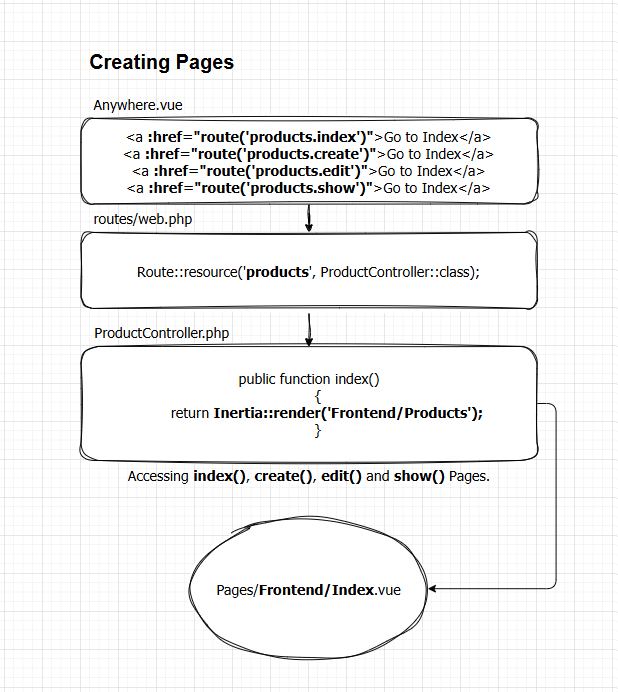

<br>

# Different Routing

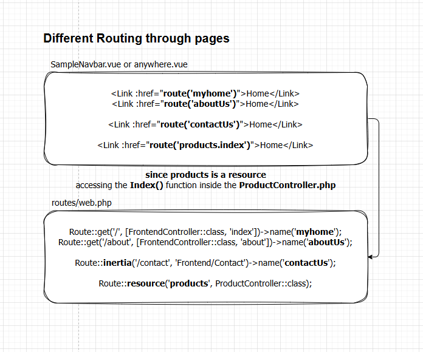

<br>

# Form helper (post, put, delete) directed to route

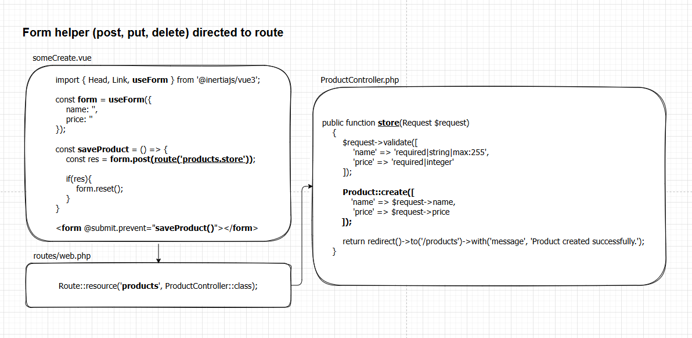

<br>

# Data Validation

1. ### We want to prevent this kind of error to pop-up when inputting a wrong data to an input field and to have a display message instead.

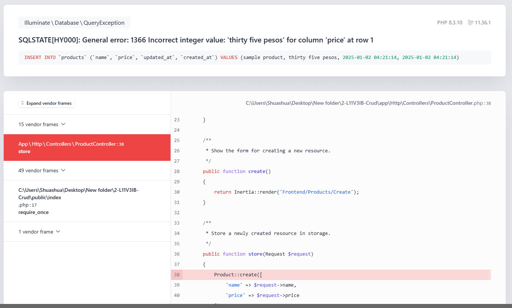

2. ### This is our store function without a validation.

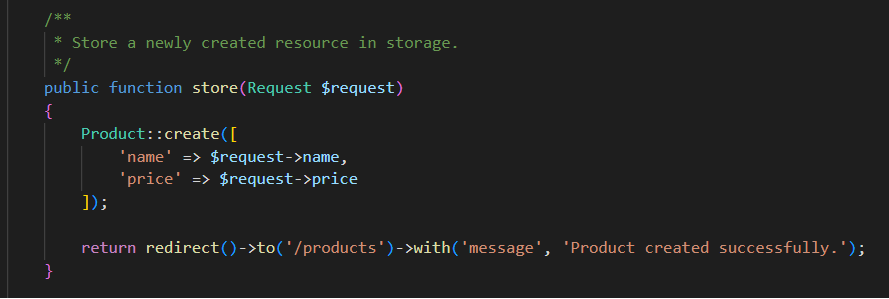

3. ### And in order to get the data for our display message, we need to include validate() to our controller.

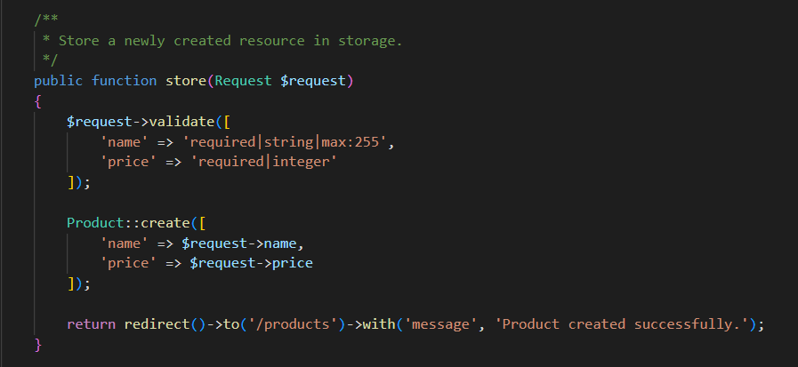

4. ### Then use it to our Frontend.

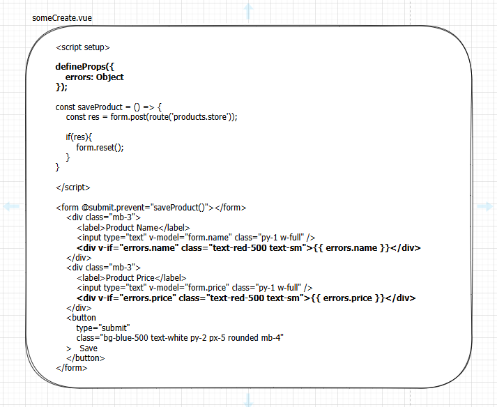

5. ### as you can see, we have now a validation error display on our Frontend.

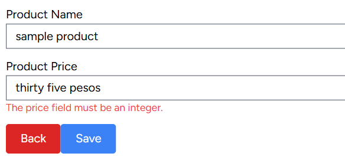

<br>

# Form Processing
### prevents the mutiple insertion of data upon clicking request.

```
<button
    type="submit"
    :disabled="form.processing"
    class="bg-blue-500 text-white py-2 px-5 rounded mb-4"
>
    <span v-if="form.processing">Saving...</span>
    <span v-else>Save</span>
</button> 
```
### now we can have this pending state after clicking the button
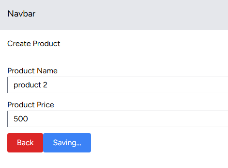

<br>

# Flash Message
### messages stored in the session only for the next request, display a message in the frontend after a successful request.

### Search for `HandleInertiaRequests` and add `flash` to the `share()` function

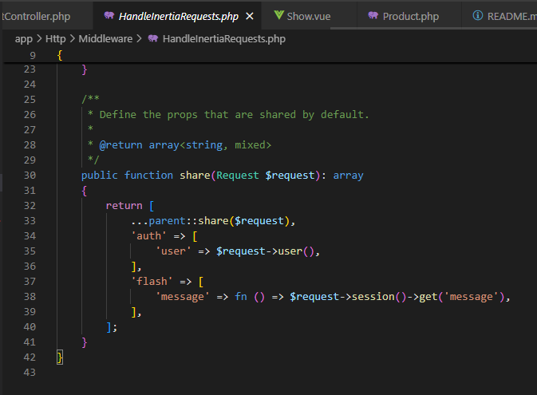

### Set a return message to your frontend as you redirected
> AnyController.php
```
return redirect()->to('/products')->with('message', 'Product updated successfully.');
```

### And add this to your Layout where you redirected after a successful request.
> Layout.vue
```
<div v-if="$page.props.flash.message" class="alert text-green-600 mt-4 ml-4">
    {{ $page.props.flash.message }}
</div>
```

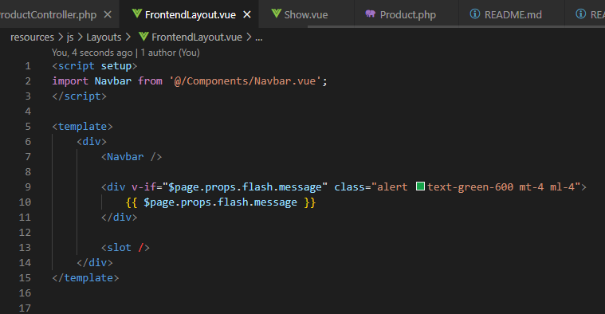

### Output as per successful request

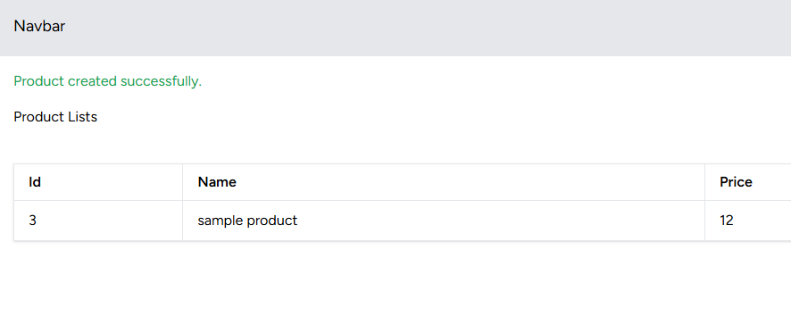
